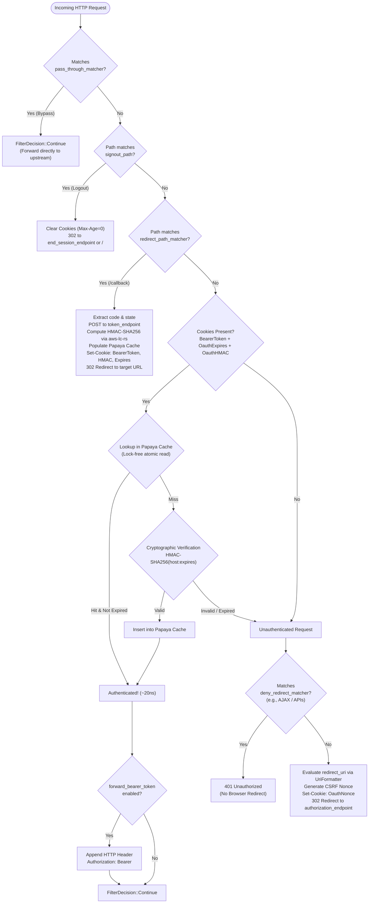

# Architectural Guide and Configuration Reference: OAuth2 Filter in Arion Gateway

This document provides a comprehensive overview of the architecture, end-to-end execution flow, high-performance caching design, and an exhaustive reference for all configuration parameters of the **OAuth2 HTTP Filter** in Arion Gateway.

---

## 1. End-to-End Architectural Flow

The filter acts as an **OpenID Connect / OAuth2 Relying Party (RP)** positioned at the gateway edge: it intercepts unauthenticated requests, coordinates the authorization flow with the Identity Provider (IdP), and authenticates downstream calls before forwarding them to upstream microservices.

```mermaid
sequenceDiagram
    autonumber
    actor Client as Browser / HTTP Client
    participant Arion as Arion Gateway (OAuth2 Filter)
    participant Cache as Papaya Session Cache (Lock-free)
    participant IdP as Identity Provider (OAuth2 / OIDC)
    participant Upstream as Upstream Backend Service

    %% Phase 1: Unauthenticated Initial Request
    Note over Client, Arion: PHASE 1: Initial Request (Unauthenticated)
    Client->>Arion: GET /dashboard (no cookies)
    Arion->>Arion: Evaluate dynamic redirect_uri via UriFormatter<br/>%REQ(x-forwarded-proto)%://%REQ(:authority)%/callback
    Arion->>Arion: Generate CSRF Nonce & prepare encoded 'state'
    Arion-->>Client: 302 Found (Location: IdP authorization_endpoint)<br/>Set-Cookie: OauthNonce=<nonce>

    %% Phase 2: IdP User Login
    Note over Client, IdP: PHASE 2: User Authentication at IdP
    Client->>IdP: GET /oauth/authorize?response_type=code&client_id=...&state=...
    IdP-->>Client: Prompt login / consent & authenticate user
    IdP-->>Client: 302 Found (Location: /callback?code=AUTH_CODE&state=/dashboard)

    %% Phase 3: Callback & Code Exchange
    Note over Client, Arion: PHASE 3: Callback & Authorization Code Exchange
    Client->>Arion: GET /callback?code=AUTH_CODE&state=/dashboard<br/>Cookie: OauthNonce=<nonce>
    Arion->>IdP: POST token_endpoint (code, client_id, token_secret, redirect_uri)
    IdP-->>Arion: 200 OK { access_token, expires_in, refresh_token, id_token }
    Arion->>Arion: Compute expires_at = now + expires_in
    Arion->>Arion: Sign HMAC-SHA256 (aws-lc-rs) over "host:expires_at"
    Arion->>Cache: Insert signature into OAUTH_SESSION_CACHE
    Arion-->>Client: 302 Found (Location: /dashboard from 'state' param)<br/>Set-Cookie: BearerToken=<token>; HttpOnly<br/>Set-Cookie: OauthExpires=<expires_at>; HttpOnly<br/>Set-Cookie: OauthHMAC=<hmac>; HttpOnly<br/>Set-Cookie: OauthNonce=; Max-Age=0

    %% Phase 4: Fast-Path with Papaya Cache
    Note over Client, Upstream: PHASE 4: Protected Resource Access (FAST PATH ~20ns)
    Client->>Arion: GET /dashboard<br/>Cookie: BearerToken=...; OauthExpires=...; OauthHMAC=...
    Arion->>Cache: Lookup OAUTH_SESSION_CACHE.pin().get(OauthHMAC)
    alt Cache Hit (Lock-free concurrent lookup, ~20ns)
        Cache-->>Arion: Session valid and unexpired
    else Cache Miss (first visit or restart)
        Arion->>Arion: Cryptographic verification HMAC-SHA256 (aws-lc-rs)
        Arion->>Cache: Populate OAUTH_SESSION_CACHE
    end
    opt If forward_bearer_token == true
        Arion->>Arion: Inject "Authorization: Bearer <token>" header
    end
    Arion->>Upstream: GET /dashboard (with Authorization: Bearer <token>)
    Upstream-->>Arion: 200 OK (Application response)
    Arion-->>Client: 200 OK

    %% Phase 5: Logout
    Note over Client, Arion: PHASE 5: User Signout (signout_path)
    Client->>Arion: GET /signout
    Arion-->>Client: 302 Found (Location: end_session_endpoint or /)<br/>Set-Cookie: BearerToken=; Max-Age=0<br/>Set-Cookie: OauthExpires=; Max-Age=0<br/>Set-Cookie: OauthHMAC=; Max-Age=0
```

---

## 2. Request Decision Pipeline

The OAuth2 filter executes a strict, ordered chain of checks on incoming requests to achieve sub-microsecond latency:



---

## 3. Configuration Reference

The configuration is organized under two primary data structures: `OAuth2Config` and `OAuth2Credentials`.

### 3.1. Main Filter Configuration (`OAuth2Config`)

| Field | Type | Default | Lifecycle Role | Description & Examples |
| :--- | :--- | :--- | :--- | :--- |
| `token_endpoint` | `HttpUri` | *Required* | Token Exchange (Phase 3) | The IdP's token endpoint (`uri`, `cluster`, `timeout`) called out-of-band by Arion to exchange the authorization code for tokens. E.g., `http://idp:8080/oauth/token`. |
| `authorization_endpoint` | `SmolStr` | *Required* | Login Redirect (Phase 1) | The browser-facing URL where Arion redirects unauthenticated users for authentication. E.g., `https://auth.example.com/oauth/authorize`. |
| `credentials` | `OAuth2Credentials` | *Required* | All Phases | Client ID, secret keys, HMAC signing key, and cookie naming settings (see Section 3.2). |
| `redirect_uri` | `SmolStr` | *Required* | Phases 1 & 3 | The redirect URI registered with the IdP. **Supports dynamic access log operators**: `%REQ(x-forwarded-proto)%://%REQ(:authority)%/callback`. Formatted on-demand with zero hot-path overhead. |
| `redirect_path_matcher` | `PathMatcher` | *Required* | Callback (Phase 3) | The exact path matcher (e.g., `exact: "/callback"`) intercepted by Arion to complete code exchange and session establishment. |
| `signout_path` | `PathMatcher` | *Required* | Logout (Phase 5) | The path (e.g., `exact: "/signout"`) that terminates user sessions by emitting `Max-Age=0` cookies and redirecting. |
| `end_session_endpoint` | `Option<SmolStr>` | `None` | Logout (Phase 5) | Optional federated OIDC logout URL. When configured, users are redirected here upon signout instead of `/`. |
| `forward_bearer_token` | `bool` | `false` | Fast-Path (Phase 4) | When `true`, extracts the access token from the session cookie and injects `Authorization: Bearer <token>` toward upstream services. |
| `preserve_authorization_header` | `bool` | `false` | Fast-Path (Phase 4) | When `true`, preserves any pre-existing `Authorization` header already sent by the client, avoiding overwrite. |
| `pass_through_matcher` | `Vec<HeaderMatcher>` | `[]` | Initial Inspection | List of header matchers to **completely bypass authentication** (e.g., public health checks, webhooks, or `x-internal-service: true`). |
| `deny_redirect_matcher` | `Vec<HeaderMatcher>` | `[]` | Unauthenticated | If an unauthenticated request matches these headers (e.g., `accept: application/json` or `x-requested-with: XMLHttpRequest`), Arion responds with **401 Unauthorized** instead of a 302 redirect. |
| `auth_scopes` | `Vec<SmolStr>` | `["user"]` | Login Redirect (Phase 1) | OAuth2/OIDC scopes requested from the IdP (e.g., `["openid", "profile", "email"]`). Space-delimited in query parameters. |
| `resources` | `Vec<SmolStr>` | `[]` | Login Redirect (Phase 1) | Optional RFC 8707 resource indicators (`resource=urn:...`) to include in authorization requests. |
| `auth_type` | `AuthType` | `url_encoded_body` | Token Exchange (Phase 3) | Authentication scheme for `token_endpoint`: `url_encoded_body` (`client_id` & `client_secret` in form body) or `basic_auth` (`Authorization: Basic base64(id:secret)`). |
| `use_refresh_token` | `bool` | `true` | Session Lifecycle | Whether to persist and utilize `RefreshToken` to renew expired sessions. |
| `default_expires_in` | `Duration` | `0s` | Token Exchange (Phase 3) | Fallback session validity duration if the IdP does not provide an `expires_in` field in its token response. |
| `default_refresh_token_expires_in` | `Duration` | `7 days` | Token Exchange (Phase 3) | Maximum lifetime for the `RefreshToken` cookie (default: 604,800 seconds). |
| `csrf_token_expires_in` | `Duration` | `10 minutes` | Login Redirect (Phase 1) | Lifetime of the temporary `OauthNonce` anti-CSRF cookie (default: 600 seconds). |
| `disable_access_token_set_cookie` | `bool` | `false` | Cookie Emission | If `true`, avoids setting the access token cookie in the browser (e.g., for IdP-only flows). |
| `disable_id_token_set_cookie` | `bool` | `false` | Cookie Emission | If `true`, avoids persisting the OIDC `IdToken` cookie on the client. |
| `disable_refresh_token_set_cookie` | `bool` | `false` | Cookie Emission | If `true`, avoids persisting the `RefreshToken` cookie on the client. |
| `cookie_configs` | `CookieConfigs` | Default | Cookie Emission | Granular per-cookie attributes (`SameSite`, `Path`, `Partitioned`). |

---

### 3.2. Credentials & Cookies (`OAuth2Credentials` and `CookieNames`)

| Field | Type | Default | Description & Usage |
| :--- | :--- | :--- | :--- |
| `client_id` | `SmolStr` | *Required* | Application ID registered with the OAuth2 Identity Provider. |
| `token_secret` | `SmolStr` | *Required* | Client secret used to authenticate against the `token_endpoint`. |
| `hmac_secret` | `SmolStr` | *Required* | **Arion Gateway private cryptographic key** used to sign and verify the `OauthHMAC` cookie via HMAC-SHA256 (`aws-lc-rs`), protecting sessions from tampering. |
| `cookie_domain` | `Option<SmolStr>` | `None` | Domain attribute for emitted cookies (e.g., `.example.com`). Scoped to the current host if omitted. |
| `cookie_names.bearer_token` | `SmolStr` | `BearerToken` | Cookie storing the OAuth2 access token. |
| `cookie_names.oauth_hmac` | `SmolStr` | `OauthHMAC` | Cookie storing the HMAC-SHA256 cryptographic session signature. |
| `cookie_names.oauth_expires` | `SmolStr` | `OauthExpires` | Cookie storing the Unix epoch expiration timestamp. |
| `cookie_names.id_token` | `SmolStr` | `IdToken` | Cookie storing the OpenID Connect ID token. |
| `cookie_names.refresh_token` | `SmolStr` | `RefreshToken` | Cookie storing the OAuth2 refresh token. |
| `cookie_names.oauth_nonce` | `SmolStr` | `OauthNonce` | Temporary cookie storing the anti-CSRF nonce. |

---

### 3.3. Granular Cookie Attributes (`CookieConfig`)

Every cookie emitted by the filter can be fine-tuned via `cookie_configs`:

- **`same_site`**: `lax` (default), `strict`, `none`, or `disabled`.
- **`path`**: Defaults to `"/"`. Defines cookie scope in client browsers.
- **`partitioned`**: `bool` (default: `false`). Attaches the modern `Partitioned` attribute (CHIPS) required when cookies operate across third-party/cross-site contexts.
