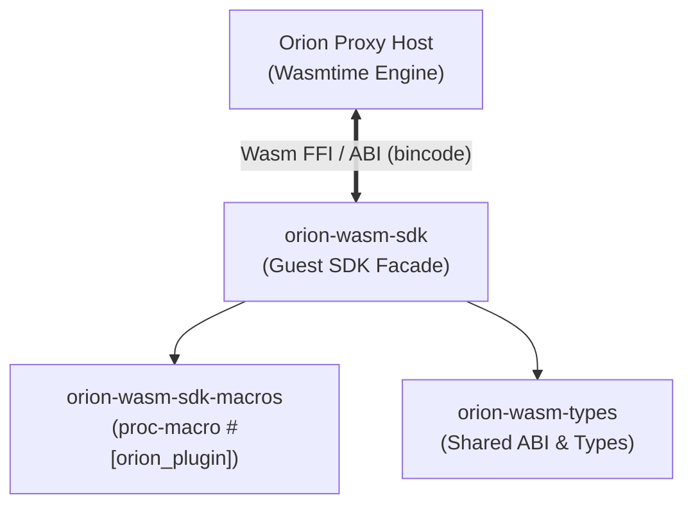
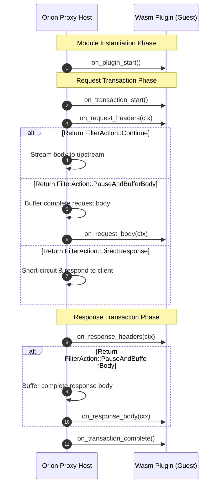
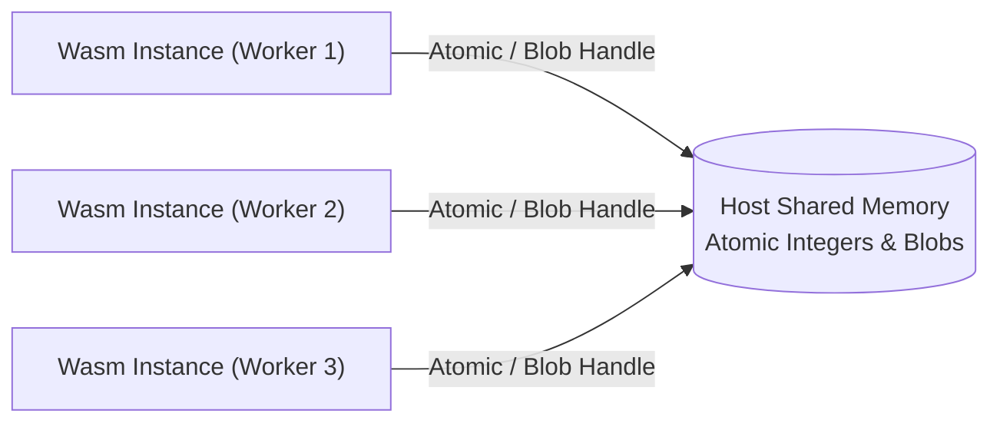

# Orion WebAssembly SDK

The **Orion WebAssembly SDK** provides a high-level, idiomatic Rust API for writing WebAssembly plugins that run inside the **Orion Proxy** via the Wasmtime runtime.

The SDK abstracts the raw Foreign Function Interface (FFI) and Wasm ABI constraints behind a safe, strongly-typed Rust interface. Plugin authors can focus purely on business logic—such as custom HTTP request routing, OAuth2/JWT authentication, body mutations, gRPC callouts, dynamic rate-limiting, custom metrics export, and thread-safe shared memory synchronization across worker instances—without handling unsafe Wasm memory allocations or ABI serialization details.

---

## Table of Contents

- [Architecture & Crates](#architecture--crates)
- [🚀 Quick Start & Building](#-quick-start--building)
  - [Cargo Configuration](#cargo-configuration)
  - [Building Wasm Binaries](#building-wasm-binaries)
  - [A Minimal Auth Plugin](#a-minimal-auth-plugin)
- [Proc-Macro & FFI Code Generation (`#[orion_plugin]`)](#proc-macro--ffi-code-generation-orion_plugin)
- [Plugin Trait & Lifecycle Hooks](#plugin-trait--lifecycle-hooks)
  - [Module Lifecycle](#module-lifecycle)
  - [Transaction Lifecycle](#transaction-lifecycle)
  - [Lifecycle Diagram](#lifecycle-diagram)
- [Typestate Pattern](#typestate-pattern)
- [HTTP Context Manipulation API](#http-context-manipulation-api)
  - [Headers API](#headers-api)
  - [Trailers API](#trailers-api)
  - [Body API](#body-api)
  - [Direct Local Responses](#direct-local-responses)
  - [Downstream Connection Metadata](#downstream-connection-metadata)
- [Host Calls & Out-of-Band Operations](#host-calls--out-of-band-operations)
  - [Plugin Configuration (`get_plugin_config`)](#plugin-configuration-get_plugin_config)
  - [Async HTTP Callouts (`dispatch_http_call`)](#async-http-callouts-dispatch_http_call)
  - [Async gRPC Callouts (`dispatch_grpc_call`)](#async-grpc-callouts-dispatch_grpc_call)
  - [Non-Blocking Sleep (`sleep`)](#non-blocking-sleep-sleep)
  - [I/O Timeouts (`set_io_timeout` & `clear_io_timeout`)](#io-timeouts-set_io_timeout--clear_io_timeout)
  - [Custom Metrics & Access Log Operators](#custom-metrics--access-log-operators)
- [Host-Backed Shared Memory Primitives](#host-backed-shared-memory-primitives)
  - [Atomic Variables (`SharedAtomicU64` / `SharedAtomicI64`)](#1-atomic-variables-sharedatomicu64--sharedatomici64)
  - [Shared Blobs & Versioned Compare-And-Swap (`SharedBlob`)](#2-shared-blobs--versioned-compare-and-swap-sharedblob)
- [Real-World Use Cases & Complete Examples](#real-world-use-cases--complete-examples)
  - [Use Case 1: Inter-Instance Request Counter (`SharedAtomicU64`)](#use-case-1-inter-instance-request-counter-sharedatomicu64)
  - [Use Case 2: Synchronized Shared Whitelist (`SharedBlob` CAS)](#use-case-2-synchronized-shared-whitelist-sharedblob-cas)
  - [Use Case 3: Distributed Concurrency Bulkhead (`fetch_update`)](#use-case-3-distributed-concurrency-bulkhead-fetch_update)
  - [Use Case 4: Asynchronous gRPC Authentication Callout](#use-case-4-asynchronous-grpc-authentication-callout)
- [Tracing, Telemetry & Logging](#tracing-telemetry--logging)
- [Error Handling & ABI Stability](#error-handling--abi-stability)
- [Included Examples Directory](#included-examples-directory)

---

## Architecture & Crates

The Orion WebAssembly ecosystem is divided into three focused crates:



1. **`orion-wasm-sdk`**: The primary guest-side SDK crate. It provides safe wrappers around hostcalls, context handles (`RequestHandle`, `ResponseHandle`), tracing subscribers, and shared memory primitives.
2. **`orion-wasm-sdk-macros`**: Contains the `#[orion_plugin]` proc-macro. It inspects your `Plugin` trait implementation and selectively emits `#[no_mangle] pub extern "C"` ABI functions for only the hooks you override.
3. **`orion-wasm-types`**: The standalone ABI crate shared between host and guest. It defines binary types (`CalloutRequest`, `GrpcCalloutRequest`, `DownstreamMetadata`, `HeaderMutation`, `FilterAction`, `OrionWasmError`, etc.) serialized via `bincode_next` across the host-guest boundary.

---

## 🚀 Quick Start & Building

### Cargo Configuration

Add `orion-wasm-sdk` and `orion-wasm-types` to your Wasm plugin's `Cargo.toml`:

```toml
[package]
name = "my-orion-filter"
version = "0.1.0"
edition = "2021"

[lib]
crate-type = ["cdylib"]

[dependencies]
orion-wasm-sdk = { path = "../orion-wasm-sdk" }
orion-wasm-types = { path = "../orion-wasm-types" }
http = "1.0"
tracing = "0.1"
```

### Building Wasm Binaries

Compile your plugin targeting WebAssembly:

```bash
# Build Wasm target
cargo build --target wasm32-unknown-unknown --release

# Alternatively using WASI target
cargo build --target wasm32-wasip1 --release
```

The resulting `.wasm` binary in `target/wasm32-unknown-unknown/release/my_orion_filter.wasm` is ready to be loaded by Orion Proxy.

### A Minimal Auth Plugin

Every plugin struct **must implement `Default`** (e.g. via `#[derive(Default)]`).

```rust
use orion_wasm_sdk::prelude::*;
use orion_wasm_types::FilterAction;

#[derive(Default)]
struct AuthFilter;

#[orion_plugin]
impl Plugin for AuthFilter {
    fn on_request_headers(&mut self, ctx: &RequestHandle<HttpHeaders>) -> FilterAction {
        match ctx.get_header("Authorization") {
            Ok(Some(v)) if v.as_bytes() == b"Bearer secret-token" => FilterAction::Continue,
            _ => {
                let response = http::Response::builder()
                    .status(401)
                    .body(bytes::Bytes::from_static(b"Unauthorized access: Invalid or missing token"))
                    .unwrap();
                ctx.direct_response(response)
            }
        }
    }
}
```

---

## Proc-Macro & FFI Code Generation (`#[orion_plugin]`)

The `#[orion_plugin]` attribute proc-macro automates FFI code generation.

When attached to an `impl Plugin for MyStruct` block:
1. It creates a thread-local static singleton instance of `MyStruct`:
   ```rust
   static mut PLUGIN: Option<MyStruct> = None;
   ```
   On the first call, it lazily instantiates `MyStruct::default()`.
2. It inspects which `Plugin` methods were implemented and generates `#[no_mangle] pub extern "C"` functions **only** for those methods. If a plugin only implements `on_request_headers`, unused FFI entry points (like `on_response_body`) are omitted from the compiled `.wasm` binary.

Generated entry point mappings:
| Trait Method | Generated FFI Export |
|---|---|
| `on_plugin_start` | `pub extern "C" fn on_plugin_start()` |
| `on_plugin_destroy` | `pub extern "C" fn on_plugin_destroy()` |
| `on_transaction_start` | `pub extern "C" fn on_transaction_start()` |
| `on_request_headers` | `pub extern "C" fn on_request_headers() -> i32` |
| `on_request_body` | `pub extern "C" fn on_request_body(body_len: u32) -> i32` |
| `on_response_headers` | `pub extern "C" fn on_response_headers() -> i32` |
| `on_response_body` | `pub extern "C" fn on_response_body(body_len: u32) -> i32` |
| `on_transaction_complete` | `pub extern "C" fn on_transaction_complete()` |

---

## Plugin Trait & Lifecycle Hooks

The `Plugin` trait exposes hooks for Wasm module initialization and individual HTTP request transactions. All methods provide default no-op implementations (returning `FilterAction::Continue`).

### Module Lifecycle
- **`fn on_plugin_start(&mut self)`**: Invoked once when the Wasm module is instantiated. Use this to parse static plugin configuration (`get_plugin_config()`), open shared memory handles (`SharedAtomicU64`, `SharedBlob`), or initialize tracing (`init_tracing()`).
- **`fn on_plugin_destroy(&mut self)`**: Invoked when the host tears down the Wasm instance.

### Transaction Lifecycle
- **`fn on_transaction_start(&mut self)`**: Invoked when a new downstream HTTP connection or request arrives.
- **`fn on_request_headers(&mut self, ctx: &RequestHandle<HttpHeaders>) -> FilterAction`**: Invoked when request headers arrive. Return `FilterAction::PauseAndBufferBody` if body inspection or mutation is required.
- **`fn on_request_body(&mut self, ctx: &RequestHandle<HttpBody>) -> FilterAction`**: Invoked after the host has buffered the full request body (only if headers returned `PauseAndBufferBody`, or if the plugin exports a body hook without a headers hook — the host then buffers implicitly).
- **`fn on_response_headers(&mut self, ctx: &ResponseHandle<HttpHeaders>) -> FilterAction`**: Invoked when upstream response headers are received.
- **`fn on_response_body(&mut self, ctx: &ResponseHandle<HttpBody>) -> FilterAction`**: Invoked after the host has buffered the full response body (same rules as request body).

`on_request_body` / `on_response_body` receive a `body_len: u32` on the raw FFI export; the high-level SDK ignores that argument and reads the payload via `get_body()`.
- **`fn on_transaction_complete(&mut self)`**: Invoked after the complete HTTP transaction finishes. Use this for cleanup or metrics aggregation.

### Lifecycle Diagram



---

## Typestate Pattern

The SDK strictly enforces compile-time state checking through Rust's **typestate pattern**:

- `RequestHandle<HttpHeaders>` and `ResponseHandle<HttpHeaders>` allow header manipulation. Calling `.get_body()` or `.get_trailer(...)` on a header context causes a **compile error**.
- `RequestHandle<HttpBody>` and `ResponseHandle<HttpBody>` permit body and trailer access. They are accessible only inside `on_request_body` and `on_response_body` after returning `FilterAction::PauseAndBufferBody`.

```rust
// Compile-time guaranteed safety:
fn on_request_headers(&mut self, ctx: &RequestHandle<HttpHeaders>) -> FilterAction {
    // Ok: Header operations are valid
    let _ = ctx.get_header("user-agent");

    // ERROR (does not compile!):
    // ctx.get_body(); 

    FilterAction::PauseAndBufferBody
}

fn on_request_body(&mut self, ctx: &RequestHandle<HttpBody>) -> FilterAction {
    // Ok: Body and Trailer operations are valid
    let body = ctx.get_body().unwrap_or_default();
    FilterAction::Continue
}
```

---

## HTTP Context Manipulation API

### Headers API

Available on `RequestHandle<HttpHeaders>`, `RequestHandle<HttpBody>`, `ResponseHandle<HttpHeaders>`, and `ResponseHandle<HttpBody>`:

- **`get_header(name: &str) -> Result<Option<HeaderValue>, OrionWasmError>`**  
  Look up a single header by name.
- **`set_header(name: HeaderName, value: HeaderValue) -> Result<(), OrionWasmError>`**  
  Overwrites any existing header with `name`.
- **`add_header(name: HeaderName, value: HeaderValue) -> Result<(), OrionWasmError>`**  
  Appends a header value (useful for multi-valued headers like `Set-Cookie`).
- **`remove_header(name: &HeaderName) -> Result<(), OrionWasmError>`**  
  Deletes all headers matching `name`.
- **`replace_header(name: HeaderName, value: HeaderValue) -> Result<(), OrionWasmError>`**  
  Replaces existing header instances.
- **`get_headers_map() -> Result<HeaderMap, OrionWasmError>`**  
  Retrieves all current HTTP headers into a standard `http::HeaderMap`.
- **`set_headers_map(headers: &HeaderMap) -> Result<(), OrionWasmError>`**  
  Replaces all headers with the given `HeaderMap`.
- **`apply_header_mutations(mutations: &[HeaderMutation]) -> Result<(), OrionWasmError>`**  
  Executes a batch of header mutations in a single FFI hostcall for optimal performance.

### URI & Status API

- **`get_uri() -> Result<http::Uri, OrionWasmError>`**  
  *(Available on `RequestHandle`)* Retrieves the current request URI.
- **`set_uri(uri: &http::Uri) -> Result<(), OrionWasmError>`**  
  *(Available on `RequestHandle`)* Updates the request URI.
- **`get_status_code() -> Result<Option<http::StatusCode>, OrionWasmError>`**  
  *(Available on `ResponseHandle`)* Retrieves the current response status code.
- **`set_status_code(status: http::StatusCode) -> Result<(), OrionWasmError>`**  
  *(Available on `ResponseHandle`)* Updates the response status code.

### Trailers API

Available on `RequestHandle<HttpBody>` and `ResponseHandle<HttpBody>`:

- `get_trailer`, `set_trailer`, `add_trailer`, `remove_trailer`, `replace_trailer`
- `get_trailers_map`, `set_trailers_map`, `apply_trailer_mutations`

### Body API

Available on `RequestHandle<HttpBody>` and `ResponseHandle<HttpBody>` (only after the host has buffered the body following `FilterAction::PauseAndBufferBody`):

- **`get_body() -> Result<bytes::Bytes, OrionWasmError>`**  
  Retrieves the buffered body payload as raw bytes.
- **`set_body(body: &[u8]) -> Result<(), OrionWasmError>`**  
  Replaces the buffered body content.

**`Content-Length`:** if the message already has a `Content-Length` header and the new body length differs, the host updates that header. It does **not** insert `Content-Length` when the header was absent (e.g. chunked transfer).

**Trailers** are not part of the body hostcalls. Use the [Trailers API](#trailers-api) (`is_trailer` is only used on header-related FFI, not on `get_body` / `set_body`).

### Full Materialization API

For comprehensive mutations, you can materialize the entire request/response into standard `http` crate types, mutate them, and write them back in a single operation. This leverages optimized `bincode-next` serialization over FFI.

Available on `RequestHandle<HttpBody>` and `ResponseHandle<HttpBody>`:

- **`take_request() -> Result<http::Request<bytes::Bytes>, OrionWasmError>`**  
  Materializes the full HTTP request (method, URI, version, headers, and body).
- **`replace_request(req: &http::Request<bytes::Bytes>) -> Result<(), OrionWasmError>`**  
  Replaces the entire HTTP request with the provided object.
- **`take_response() -> Result<http::Response<bytes::Bytes>, OrionWasmError>`**  
  Materializes the full HTTP response (status, version, headers, and body).
- **`replace_response(res: &http::Response<bytes::Bytes>) -> Result<(), OrionWasmError>`**  
  Replaces the entire HTTP response with the provided object.

### Direct Local Responses

Available on `RequestHandle`:

- **`schedule_direct_response(response: http::Response<bytes::Bytes>) -> Result<(), OrionWasmError>`**  
  Prepares and schedules a direct HTTP response payload in host memory for the current transaction. Calling `schedule_direct_response` does **not** interrupt Wasm plugin execution immediately; the response is staged on the host and transmitted to the client once the plugin hook returns `FilterAction::DirectResponse`.
- **`direct_response(response: http::Response<bytes::Bytes>) -> FilterAction`**  
  A convenience helper that schedules the response via `schedule_direct_response` and immediately returns `FilterAction::DirectResponse`. This signals the host to exit plugin processing, short-circuit the proxy filter chain, and deliver the staged response directly to the client.

```rust
fn on_request_headers(&mut self, ctx: &RequestHandle<HttpHeaders>) -> FilterAction {
    if is_blacklisted(ctx) {
        // Schedules a 403 response and returns FilterAction::DirectResponse to exit the plugin
        let response = http::Response::builder()
            .status(403)
            .body(bytes::Bytes::from_static(b"Access Denied"))
            .unwrap();
        return ctx.direct_response(response);
    }
    FilterAction::Continue
}
```

### Downstream Connection Metadata

Inspect transport and connection properties via `ctx.get_downstream_metadata()`:

```rust
use orion_wasm_types::{DownstreamMetadata, DownstreamConnectionMetadata};

if let Ok(Some(meta)) = ctx.get_downstream_metadata() {
    tracing::info!("Listener: {}", meta.listener_name);
    if let Some(sni) = &meta.sni {
        tracing::info!("TLS SNI: {}", sni);
    }
    match &meta.connection {
        DownstreamConnectionMetadata::FromSocket { peer_address, local_address } => {
            tracing::info!("Socket Remote IP: {}", peer_address);
        }
        DownstreamConnectionMetadata::FromProxyProtocol { proxy_peer_address, .. } => {
            tracing::info!("Proxy Protocol IP: {}", proxy_peer_address);
        }
    }
}
```

---

## Host Calls & Out-of-Band Operations

### Plugin Configuration (`get_plugin_config`)

Retrieve the plugin's raw configuration string (JSON/YAML) assigned by the host control plane:

```rust
fn on_plugin_start(&mut self) {
    if let Ok(Some(config_str)) = orion_wasm_sdk::get_plugin_config() {
        tracing::info!("Loaded config: {}", config_str);
    }
}
```

### Async HTTP Callouts (`dispatch_http_call`)

Dispatch out-of-band asynchronous HTTP requests to external clusters (e.g. auth servers or rate-limiting services). **Non-blocking** on proxy threads:

```rust
use orion_wasm_sdk::dispatch_http_call;

let req = http::Request::builder()
    .method(http::Method::POST)
    .uri("/verify")
    .body(bytes::Bytes::from("token=xyz"))
    .unwrap();

match dispatch_http_call("auth_cluster", req) {
    Ok(resp) if resp.status().is_success() => {
        tracing::info!("Auth successful!");
    }
    _ => tracing::error!("Auth failed or cluster unreachable"),
}
```

### Async gRPC Callouts (`dispatch_grpc_call`)

Dispatch native gRPC requests to upstream services using the `GrpcCalloutRequest` and `GrpcCalloutResponse` structs:

```rust
pub struct GrpcCalloutRequest {
    pub cluster_name: smol_str::SmolStr,
    pub service_name: smol_str::SmolStr,
    pub method_name: smol_str::SmolStr,
    pub initial_metadata: Vec<(smol_str::SmolStr, smol_str::SmolStr)>,
    pub message: bytes::Bytes,
}

pub struct GrpcCalloutResponse {
    pub initial_metadata: Vec<(smol_str::SmolStr, smol_str::SmolStr)>,
    pub message: bytes::Bytes,
    pub trailing_metadata: Vec<(smol_str::SmolStr, smol_str::SmolStr)>,
    pub status: u32, // gRPC status code
    pub status_message: smol_str::SmolStr,
}
```

```rust
use orion_wasm_sdk::dispatch_grpc_call;
use orion_wasm_types::{GrpcCalloutRequest, GrpcCalloutResponse};
use smol_str::SmolStr;

let grpc_req = GrpcCalloutRequest {
    cluster_name: SmolStr::new("grpc_service_cluster"),
    service_name: SmolStr::new("my.package.AuthService"),
    method_name: SmolStr::new("ValidateToken"),
    initial_metadata: vec![(SmolStr::new("x-request-id"), SmolStr::new("12345"))],
    message: bytes::Bytes::from(protobuf_encoded_bytes),
};

match dispatch_grpc_call(&grpc_req) {
    Ok(resp) if resp.status == 0 => {
        // gRPC OK (status 0)
        let response_payload = resp.message;
    }
    Ok(resp) => tracing::error!("gRPC call returned status {}", resp.status),
    Err(e) => tracing::error!("gRPC dispatch error: {:?}", e),
}
```

### Non-Blocking Sleep (`sleep`)

The `sleep(duration)` function suspends the execution of the WebAssembly module for the requested `Duration`. Because Orion utilizes an asynchronous Wasm runtime engine, `sleep` yields execution back to the host event loop and **does not block** proxy server threads or concurrent HTTP traffic:

```rust
use std::time::Duration;
use orion_wasm_sdk::sleep;

// Suspend Wasm plugin execution for 500 milliseconds non-blockingly
match sleep(Duration::from_millis(500)) {
    Ok(_) => tracing::info!("Sleep completed, resuming execution"),
    Err(e) => tracing::error!("Sleep failed: {:?}", e),
}
```

### I/O Timeouts (`set_io_timeout` & `clear_io_timeout`)

The `set_io_timeout(duration)` function sets an absolute execution deadline for subsequent asynchronous out-of-band I/O operations (such as `dispatch_http_call` or `dispatch_grpc_call`). If the external service fails to respond within the allocated deadline, the host aborts the operation and returns `Err(OrionWasmError::Timeout)`.

Call `clear_io_timeout()` after the I/O operation finishes to disarm the deadline:

```rust
use std::time::Duration;
use orion_wasm_sdk::{set_io_timeout, clear_io_timeout, dispatch_http_call, OrionWasmError};
use orion_wasm_types::CalloutRequest;
use smol_str::SmolStr;

let req = http::Request::builder()
    .method(http::Method::POST)
    .uri("/verify")
    .body(bytes::Bytes::from("token=xyz"))
    .unwrap();

// Enforce a 2-second timeout for the upcoming HTTP callout
if let Err(e) = set_io_timeout(Duration::from_secs(2)) {
    tracing::error!("Failed to set IO timeout: {:?}", e);
}

// Dispatch the HTTP callout with active timeout safeguard
match dispatch_http_call("auth_cluster", req) {
    Ok(response) => {
        tracing::info!("Received HTTP callout response: status {}", response.status());
    }
    Err(OrionWasmError::Timeout) => {
        tracing::warn!("HTTP callout timed out after 2 seconds!");
    }
    Err(e) => {
        tracing::error!("HTTP callout failed with error: {:?}", e);
    }
}

// Disarm the IO timeout deadline
let _remaining_time = clear_io_timeout();
```

### Custom Metrics & Access Log Operators

Inject telemetry and custom fields into proxy logs:

```rust
// Export custom metrics key-value pairs
orion_wasm_sdk::set_custom_metrics([
    ("requests_authenticated", "1"),
    ("auth_latency_ms", "12"),
])?;

// Inject access log variables
orion_wasm_sdk::set_access_log_operators([
    ("user_id", "user_12345"),
    ("auth_tier", "premium"),
])?;
```

---

## Host-Backed Shared Memory Primitives

Wasm module instances in Orion are isolated per thread/connection. To share state across concurrent requests and worker threads safely, the SDK provides host-backed **Shared Memory Primitives** under `orion_wasm_sdk::shared`.

Shared variables are referenced by string names. When `try_new("name")` is invoked, the host resolves or allocates the underlying host-managed variable.



### 1. Atomic Variables (`SharedAtomicU64` / `SharedAtomicI64`)

Provide thread-safe atomic operations mirroring `std::sync::atomic`.

- **`SharedAtomicU64::try_new(name: &str) -> Result<SharedAtomicU64, SharedVarError>`**
- **`load(order: Ordering) -> u64`**
- **`store(val: u64, order: Ordering)`**
- **`swap(val: u64, order: Ordering) -> u64`**
- **`compare_exchange(current, new, success, failure) -> Result<u64, u64>`**
- **`fetch_add(val, order)`**, **`fetch_sub`**, **`fetch_and`**, **`fetch_or`**, **`fetch_xor`**, **`fetch_max`**, **`fetch_min`**
- **`fetch_update(set_order, fetch_order, closure) -> Result<u64, u64>`**

### 2. Shared Blobs & Versioned Compare-And-Swap (`SharedBlob`)

`SharedBlob` provides host-backed storage for dynamic byte buffers (`Vec<u8>`) synchronized via **Versioned Compare-And-Swap (CAS)** using a monotonic version counter (`u64`).

```rust
pub struct BlobData {
    pub data: Vec<u8>,
    pub version: u64,
}
```

- **`SharedBlob::try_new(name: &str) -> Result<SharedBlob, SharedVarError>`**
- **`read(&self) -> BlobData`**: Reads data payload and its current version.
- **`write(&self, data: &[u8]) -> u64`**: Unconditionally overwrites content and increments version.
- **`compare_and_swap(&self, data: &[u8], expected_version: u64) -> Result<u64, ()>`**: Atomically updates content **only if** version matches `expected_version`.

---

## Real-World Use Cases & Complete Examples

### Use Case 1: Inter-Instance Request Counter (`SharedAtomicU64`)

Inject a global sequence counter header into all requests across all Wasm instances:

```rust
use orion_wasm_sdk::prelude::*;
use orion_wasm_sdk::shared::SharedAtomicU64;
use orion_wasm_types::HeaderMutation;
use std::sync::atomic::Ordering;

#[derive(Default)]
struct GlobalCounterFilter {
    counter: Option<SharedAtomicU64>,
}

#[orion_plugin]
impl Plugin for GlobalCounterFilter {
    fn on_plugin_start(&mut self) {
        let _ = orion_wasm_sdk::init_tracing();
        if let Ok(atomic) = SharedAtomicU64::try_new("global_http_requests") {
            self.counter = Some(atomic);
        }
    }

    fn on_request_headers(&mut self, ctx: &RequestHandle<HttpHeaders>) -> FilterAction {
        if let Some(counter) = &self.counter {
            let req_num = counter.fetch_add(1, Ordering::SeqCst) + 1;
            if let Ok(val) = http::HeaderValue::from_str(&req_num.to_string()) {
                let _ = ctx.apply_header_mutations(&[
                    HeaderMutation::Set(http::HeaderName::from_static("x-global-req-num"), val)
                ]);
            }
        }
        FilterAction::Continue
    }
}
```

---

### Use Case 2: Synchronized Shared Whitelist (`SharedBlob` CAS)

Maintain a thread-safe list of active client IDs synchronized using versioned Compare-And-Swap:

```rust
use orion_wasm_sdk::prelude::*;
use orion_wasm_sdk::shared::SharedBlob;

#[derive(Default)]
struct ClientTrackerFilter {
    blob: Option<SharedBlob>,
}

#[orion_plugin]
impl Plugin for ClientTrackerFilter {
    fn on_plugin_start(&mut self) {
        let _ = orion_wasm_sdk::init_tracing();
        if let Ok(blob) = SharedBlob::try_new("active_clients") {
            let current = blob.read();
            if current.version == 0 && current.data.is_empty() {
                blob.write(b"");
            }
            self.blob = Some(blob);
        }
    }

    fn on_request_headers(&mut self, ctx: &RequestHandle<HttpHeaders>) -> FilterAction {
        if let Some(blob) = &self.blob {
            let client_id = ctx.get_header("x-client-id")
                .ok()
                .flatten()
                .and_then(|v| v.to_str().ok().map(String::from))
                .unwrap_or_else(|| "anonymous".to_string());

            loop {
                let current = blob.read();
                let current_str = String::from_utf8_lossy(&current.data);

                if current_str.split(',').any(|s| s.trim() == client_id) {
                    break; // Already recorded
                }

                let updated = if current_str.is_empty() {
                    client_id.clone()
                } else {
                    format!("{}, {}", current_str, client_id)
                };

                if blob.compare_and_swap(updated.as_bytes(), current.version).is_ok() {
                    tracing::info!("Added client {} (blob v{})", client_id, current.version + 1);
                    break;
                }
                // CAS failed due to concurrent update — retry loop
            }
        }
        FilterAction::Continue
    }
}
```

---

### Use Case 3: Distributed Concurrency Bulkhead (`fetch_update`)

Enforce a global maximum concurrent requests limit across proxy threads:

```rust
use orion_wasm_sdk::prelude::*;
use orion_wasm_sdk::shared::SharedAtomicU64;
use std::sync::atomic::Ordering;

const MAX_CONCURRENT_REQUESTS: u64 = 500;

#[derive(Default)]
struct BulkheadFilter {
    active_requests: Option<SharedAtomicU64>,
    incremented: bool,
}

#[orion_plugin]
impl Plugin for BulkheadFilter {
    fn on_plugin_start(&mut self) {
        if let Ok(atomic) = SharedAtomicU64::try_new("bulkhead_active_reqs") {
            self.active_requests = Some(atomic);
        }
    }

    fn on_request_headers(&mut self, ctx: &RequestHandle<HttpHeaders>) -> FilterAction {
        if let Some(counter) = &self.active_requests {
            let res = counter.fetch_update(Ordering::SeqCst, Ordering::Relaxed, |curr| {
                if curr < MAX_CONCURRENT_REQUESTS {
                    Some(curr + 1)
                } else {
                    None
                }
            });

            if res.is_err() {
                let response = http::Response::builder()
                    .status(429)
                    .body(bytes::Bytes::from_static(b"Bulkhead limit reached. Try again later."))
                    .unwrap();
                return ctx.direct_response(response);
            }
            self.incremented = true;
        }
        FilterAction::Continue
    }

    fn on_transaction_complete(&mut self) {
        if self.incremented {
            if let Some(counter) = &self.active_requests {
                counter.fetch_sub(1, Ordering::SeqCst);
            }
            self.incremented = false;
        }
    }
}
```

---

### Use Case 4: Asynchronous gRPC Authentication Callout

Verify request authorization against a remote gRPC service before allowing downstream transit:

```rust
use orion_wasm_sdk::prelude::*;
use orion_wasm_sdk::dispatch_grpc_call;
use orion_wasm_types::GrpcCalloutRequest;
use smol_str::SmolStr;

#[derive(Default)]
struct GrpcAuthFilter;

#[orion_plugin]
impl Plugin for GrpcAuthFilter {
    fn on_request_headers(&mut self, ctx: &RequestHandle<HttpHeaders>) -> FilterAction {
        let auth_token = match ctx.get_header("authorization") {
            Ok(Some(val)) => val.to_str().unwrap_or("").to_string(),
            _ => {
                let response = http::Response::builder().status(401).body(bytes::Bytes::from_static(b"Missing authorization header")).unwrap();
                return ctx.direct_response(response);
            }
        };

        let grpc_req = GrpcCalloutRequest {
            cluster_name: SmolStr::new("auth_grpc_cluster"),
            service_name: SmolStr::new("auth.AuthService"),
            method_name: SmolStr::new("VerifyToken"),
            initial_metadata: vec![(SmolStr::new("authorization"), SmolStr::new(auth_token))],
            message: bytes::Bytes::new(), // Protobuf message bytes
        };

        match dispatch_grpc_call(&grpc_req) {
            Ok(resp) if resp.status == 0 => FilterAction::Continue,
            Ok(resp) => {
                let err_msg = format!("Auth service rejected token: {}", resp.status_message);
                let response = http::Response::builder().status(403).body(bytes::Bytes::from(err_msg)).unwrap();
                ctx.direct_response(response)
            }
            Err(_) => {
                let response = http::Response::builder().status(500).body(bytes::Bytes::from_static(b"Internal auth service error")).unwrap();
                ctx.direct_response(response)
            }
        }
    }
}
```

---

## Tracing, Telemetry & Logging

The SDK bridges standard Rust `tracing` events directly to Orion's host logging framework over FFI.

Initialize tracing **once** inside `on_plugin_start`:

```rust
fn on_plugin_start(&mut self) {
    let _ = orion_wasm_sdk::init_tracing();

    tracing::info!("Plugin initialized!");
    tracing::warn!("Warning message");
    tracing::error!(target: "security", "Security assertion triggered");
}
```

Calls to `tracing::error!`, `warn!`, `info!`, `debug!`, and `trace!` are automatically formatted and forwarded to host logs with their respective severity levels.

---

## Error Handling & ABI Stability

Functions return `Result<T, OrionWasmError>`. The `OrionWasmError` enum is part of the stable ABI:

| Variant | Value | Description |
|---|---|---|
| `NotFound` | `1` | Requested resource, header, or variable was not found. |
| `BufferTooSmall` | `2` | Provided FFI buffer size was insufficient. |
| `InvalidMemoryAccess` | `3` | Memory pointer or length violation across host boundary. |
| `InternalError` | `4` | Serialization error or host internal error. |
| `Timeout` | `5` | I/O operation or sleep timed out. |

### Hostcall ABI notes (guest ↔ host)

- **Header / trailer hostcalls** take an `is_trailer: u32` flag (`0` = headers, `1` = trailers): `orion_get_header`, `orion_set_header`, `orion_get_headers_map`, `orion_apply_header_mutations`, etc.
- **Body hostcalls do not** take `is_trailer`:
  - `orion_get_body(body_ptr, max_len, written_len_ptr)`
  - `orion_set_body(body_ptr, body_len)`
  Request vs response body is selected by the host from the active transaction phase (`active_request_handle` / `active_response_handle`), not by a guest flag.
- **Guest must export `orion_malloc(size) -> *mut u8`** (provided by this SDK in `lib.rs`). The host uses it when writing callout responses and downstream metadata into guest linear memory.
- Changing numeric enum values, hostcall signatures, or bincode layouts is a **breaking ABI change**: rebuild guest `.wasm` plugins against a matching host/SDK pair.

---

## Included Examples Directory

Ready-to-build standalone example plugins under [`examples/`](./examples):

| Example Directory | Focus / Feature Demonstrated |
|---|---|
| [`access_log_operator_filter`](./examples/access_log_operator_filter) | Dynamic access log operator injection (`set_access_log_operators`) |
| [`benchmark_filter`](./examples/benchmark_filter) | High-performance header passing benchmark |
| [`body_mutation_filter`](./examples/body_mutation_filter) | Request & response body buffering and content mutation (`set_body`) |
| [`callout_authz_filter`](./examples/callout_authz_filter) | HTTP callout authorization gate |
| [`callout_body_filter`](./examples/callout_body_filter) | Async HTTP out-of-band callouts (`dispatch_http_call`) |
| [`config_logger_filter`](./examples/config_logger_filter) | Reading and parsing Wasm configuration (`get_plugin_config`) |
| [`custom_metric_filter`](./examples/custom_metric_filter) | Telemetry and custom metric exports (`set_custom_metrics`) |
| [`direct_response_filter`](./examples/direct_response_filter) | Short-circuit with `direct_response` / `FilterAction::DirectResponse` |
| [`dummy_filter`](./examples/dummy_filter) | Minimal no-op filter template |
| [`grpc_callout_filter`](./examples/grpc_callout_filter) | Async gRPC out-of-band callouts with Protobuf (`dispatch_grpc_call`) |
| [`header_api_filter`](./examples/header_api_filter) | Single header getters, setters, and removals |
| [`header_mutations_filter`](./examples/header_mutations_filter) | Batch header mutations (`apply_header_mutations`) |
| [`headers_map_filter`](./examples/headers_map_filter) | `HeaderMap` serialization & bulk header manipulation |
| [`materialize_filter`](./examples/materialize_filter) | Full request/response materialization (`take_request` / `replace_request`, …) |
| [`metadata_filter`](./examples/metadata_filter) | Downstream connection metadata, TLS SNI, and SocketAddr inspection |
| [`shared_atomic`](./examples/shared_atomic) | Thread-safe shared atomic integers across Wasm instances (`SharedAtomicU64`) |
| [`shared_blob`](./examples/shared_blob) | Versioned Compare-And-Swap (CAS) shared memory blob storage (`SharedBlob`) |
| [`sleep_timeout_filter`](./examples/sleep_timeout_filter) | Non-blocking sleep and I/O deadline enforcement (`sleep`, `set_io_timeout`) |
| [`uri_status_filter`](./examples/uri_status_filter) | Request URI and response status get/set |
